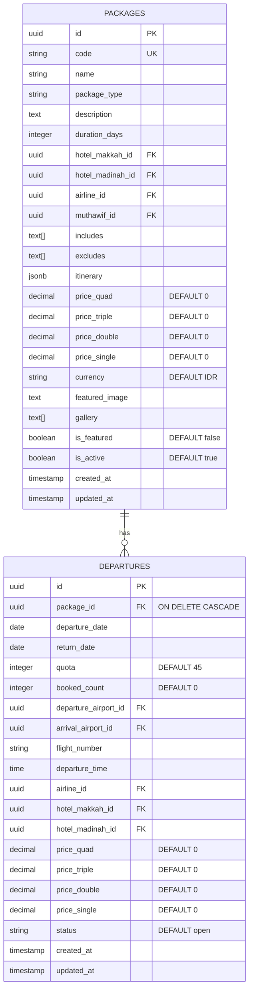
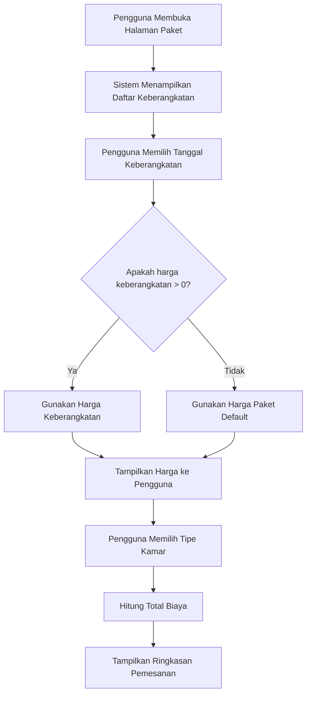
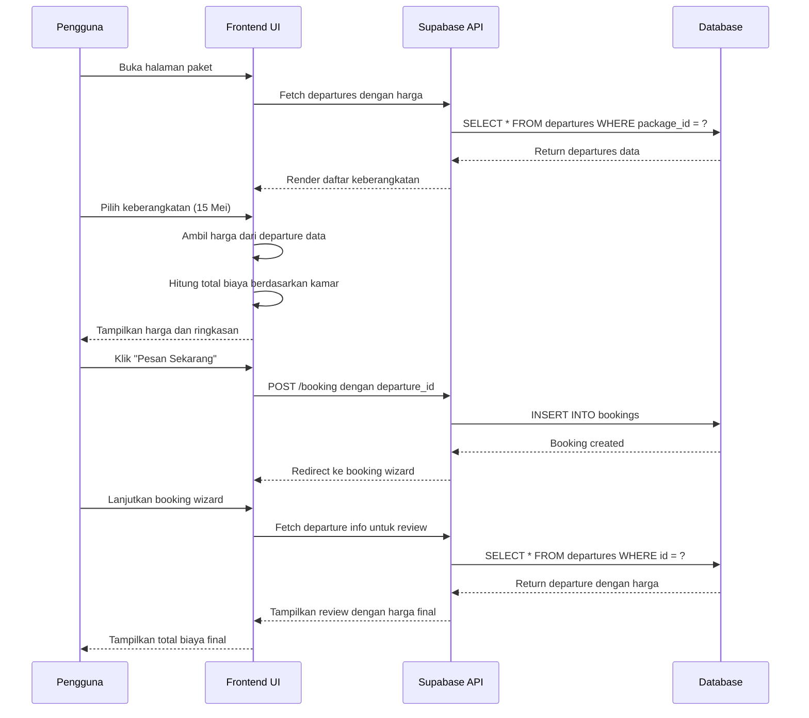
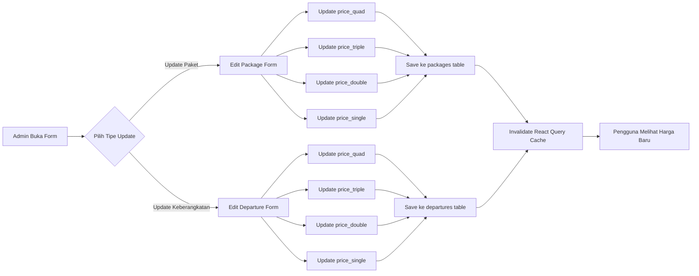
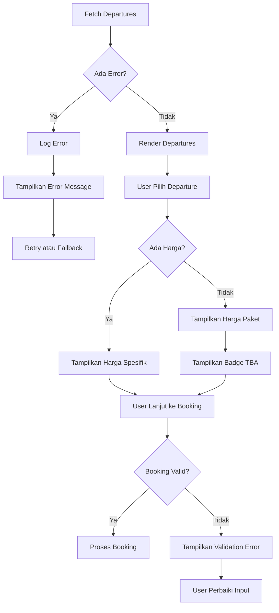

# Diagram Relasi Paket-Keberangkatan

## 1. Entity Relationship Diagram (ERD)



## 2. Alur Penetapan Harga



## 3. Struktur Data Harga

```
┌─────────────────────────────────────────────────────┐
│                    PACKAGES TABLE                   │
├─────────────────────────────────────────────────────┤
│ id: UUID                                            │
│ name: "Umroh Plus"                                  │
│ price_quad: 25,000,000 IDR    ← Harga Default      │
│ price_triple: 22,000,000 IDR                        │
│ price_double: 20,000,000 IDR                        │
│ price_single: 28,000,000 IDR                        │
└─────────────────────────────────────────────────────┘
                        │
                        │ 1:N Relationship
                        │
        ┌───────────────┴───────────────┐
        │                               │
┌───────▼──────────────┐    ┌──────────▼──────────────┐
│  DEPARTURES #1       │    │  DEPARTURES #2          │
├──────────────────────┤    ├─────────────────────────┤
│ departure_date: 15-5 │    │ departure_date: 20-5    │
│ price_quad: 26M ✓    │    │ price_quad: 0 (kosong)  │
│ price_triple: 23M ✓  │    │ price_triple: 0         │
│ price_double: 21M ✓  │    │ price_double: 0         │
│ price_single: 29M ✓  │    │ price_single: 0         │
├──────────────────────┤    ├─────────────────────────┤
│ Harga Spesifik       │    │ Fallback ke Paket       │
│ (Prioritas Tinggi)   │    │ (Harga TBA)             │
└──────────────────────┘    └─────────────────────────┘
```

## 4. Alur Booking Lengkap



## 5. Hirarki Penetapan Harga

```
┌──────────────────────────────────────────────────────────┐
│                  PRICING HIERARCHY                       │
├──────────────────────────────────────────────────────────┤
│                                                          │
│  Level 1 (Tertinggi): Harga Keberangkatan               │
│  ├─ Sumber: departures.price_quad/triple/double/single │
│  ├─ Kondisi: Digunakan jika > 0                         │
│  ├─ Prioritas: TERTINGGI                                │
│  └─ Contoh: 26,000,000 IDR (musim ramai)                │
│                                                          │
│  Level 2: Harga Paket Default                           │
│  ├─ Sumber: packages.price_quad/triple/double/single    │
│  ├─ Kondisi: Digunakan jika harga keberangkatan = 0     │
│  ├─ Prioritas: FALLBACK                                 │
│  └─ Contoh: 25,000,000 IDR (harga standar)              │
│                                                          │
│  Level 3: Harga TBA (To Be Announced)                   │
│  ├─ Sumber: Tidak ada harga tersedia                    │
│  ├─ Kondisi: Keberangkatan baru tanpa harga             │
│  ├─ Prioritas: TERENDAH                                 │
│  └─ Contoh: Badge "Harga TBA" ditampilkan               │
│                                                          │
└──────────────────────────────────────────────────────────┘
```

## 6. Alur Admin Update Harga



## 7. Validasi Data

```
┌─────────────────────────────────────────────────────┐
│              VALIDATION RULES                       │
├─────────────────────────────────────────────────────┤
│                                                     │
│ 1. Harga Keberangkatan                              │
│    ├─ price_quad >= 0                              │
│    ├─ price_triple >= 0                            │
│    ├─ price_double >= 0                            │
│    └─ price_single >= 0                            │
│                                                     │
│ 2. Tanggal Keberangkatan                            │
│    ├─ departure_date < return_date                 │
│    ├─ departure_date >= TODAY                      │
│    └─ return_date >= TODAY                         │
│                                                     │
│ 3. Kuota Keberangkatan                              │
│    ├─ quota > 0                                    │
│    ├─ booked_count <= quota                        │
│    └─ booked_count >= 0                            │
│                                                     │
│ 4. Status Keberangkatan                             │
│    ├─ status IN ('open', 'closed', 'departed',     │
│    │             'completed')                      │
│    └─ Hanya keberangkatan 'open' dapat dipesan     │
│                                                     │
└─────────────────────────────────────────────────────┘
```

## 8. Query Pattern

```sql
-- Pattern 1: Ambil keberangkatan dengan harga (fallback)
SELECT 
  d.id,
  d.departure_date,
  d.return_date,
  COALESCE(d.price_quad, p.price_quad) as price_quad,
  COALESCE(d.price_triple, p.price_triple) as price_triple,
  COALESCE(d.price_double, p.price_double) as price_double,
  COALESCE(d.price_single, p.price_single) as price_single
FROM departures d
JOIN packages p ON d.package_id = p.id
WHERE d.package_id = $1
  AND d.status = 'open'
  AND d.departure_date >= CURRENT_DATE
ORDER BY d.departure_date ASC;

-- Pattern 2: Ambil keberangkatan dengan harga spesifik saja
SELECT 
  d.id,
  d.departure_date,
  d.price_quad,
  d.price_triple,
  d.price_double,
  d.price_single
FROM departures d
WHERE d.package_id = $1
  AND d.price_quad > 0
  AND d.status = 'open'
ORDER BY d.departure_date ASC;

-- Pattern 3: Identifikasi keberangkatan tanpa harga (TBA)
SELECT 
  d.id,
  d.departure_date,
  p.name as package_name
FROM departures d
JOIN packages p ON d.package_id = p.id
WHERE d.price_quad = 0
  AND d.price_triple = 0
  AND d.price_double = 0
  AND d.price_single = 0
  AND d.status = 'open'
ORDER BY d.departure_date ASC;
```

## 9. State Management (React)

```typescript
// Component State
interface BookingState {
  selectedPackageId: string;
  selectedDepartureId: string;
  selectedDeparture: {
    id: string;
    departure_date: string;
    price_quad: number;
    price_triple: number;
    price_double: number;
    price_single: number;
  };
  roomAllocation: {
    quad: number;
    triple: number;
    double: number;
    single: number;
  };
  prices: {
    quad: number;
    triple: number;
    double: number;
    single: number;
  };
  totalPassengers: number;
  totalPrice: number;
}

// Computed Values
const prices = useMemo(() => {
  if (!selectedDeparture) return { quad: 0, triple: 0, double: 0, single: 0 };
  return {
    quad: selectedDeparture.price_quad || 0,
    triple: selectedDeparture.price_triple || 0,
    double: selectedDeparture.price_double || 0,
    single: selectedDeparture.price_single || 0,
  };
}, [selectedDeparture]);

const totalPrice = useMemo(() => {
  return (roomAllocation.quad * prices.quad) +
         (roomAllocation.triple * prices.triple) +
         (roomAllocation.double * prices.double) +
         (roomAllocation.single * prices.single);
}, [roomAllocation, prices]);
```

## 10. Error Handling



